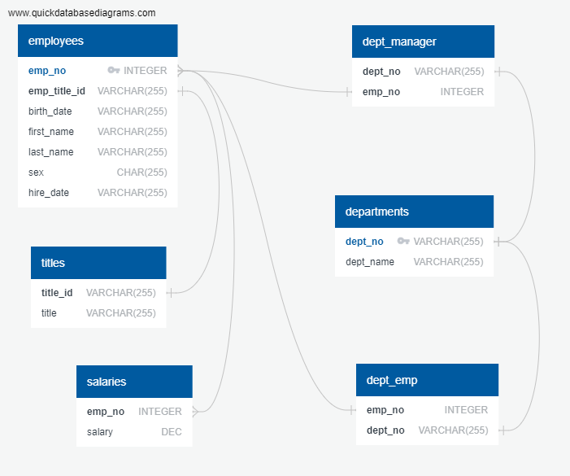
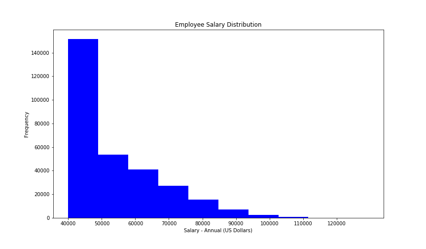
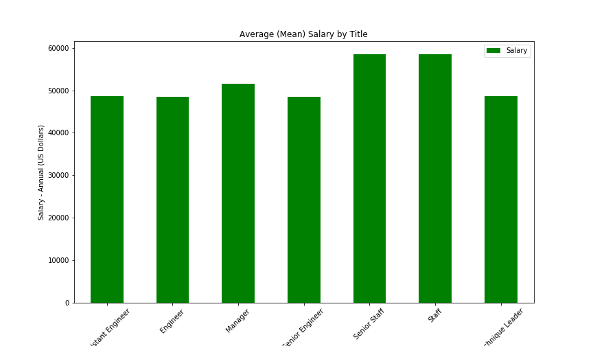

# SQL Homework - Employee Database: A Mystery in Two Parts


# Rob Gauer
### Date Due:  May 9, 2020
# OVERVIEW
It is a beautiful spring day, and it is two weeks since you have been hired as a new data engineer at Pewlett Hackard. Your first major task is a research project on employees of the corporation from the 1980s and 1990s. All that remain of the database of employees from that period are six CSV files.
## SQL HOMEWORK - README.md  
SQL Homework Background and Requirement Instructions. Includes Links to Code Programs and Display of Chart Outputs.   
(FYI - YOU are currently reading this document...)  
 https://github.com/robgauer/sql-challenge/blob/master/README.md

## DATA MODELING - ERD
Employee Data Modeling ERD image file is located at folder, Link:  
 https://github.com/robgauer/sql-challenge/blob/master/EmployeeSQL/data_modeling_ERD/ERD_Gauer_HP_Employee_db_QuickDBD-export.png    
 [http://www.quickdatabasediagrams.com]

## DATA ENGINEERING - PostgresSQL Database Creation
Employee Database PostgresSQL code file is located at folder, Link:   
 https://github.com/robgauer/sql-challenge/blob/master/EmployeeSQL/Code_employee_sql/employee_db_schemata.sql

## DATA ANALYSIS - PostgresSQL Database Queries
Employee Database PostgresSQL code query file is located at folder, Link:  
 https://github.com/robgauer/sql-challenge/blob/master/EmployeeSQL/code_employee_sql/employee_db_queries.sql

## OPTIONAL - PANDAS BONUS ANALYSIS
Use PANDAS to connect to the Employee Database. Use Pandas for Bonus Analysis. Pandas code file is located at folder, Link:  
 https://github.com/robgauer/sql-challenge/blob/master/EmployeeSQL/code_pandas/HP_employee_db_pandas_bonus_analysis.ipynb
  *  HISTOGRAM 'Common Salary Ranges for Employees' Link:   
  https://github.com/robgauer/sql-challenge/blob/master/EmployeeSQL/output_images/Histogram_Common_Salary_Ranges_for_Employees.png
 *   BAR CHART 'Average Salary by Title' Link:   
  https://github.com/robgauer/sql-challenge/blob/master/EmployeeSQL/output_images/Bar_Chart_Average_Salary_by_Title.png
 *   EPILOGUE 'HP Employee Lookup 499942' Link:   
  https://github.com/robgauer/sql-challenge/blob/master/EmployeeSQL/output_chart_dataframes/HP_Employees_Lookup_Employee_499942.csv

## DISPLAY of OUTPUT FILES
#### ERD 'Data Modeling of data files for Database Design'


#### HISTOGRAM 'Common Salary Ranges for Employees'


#### BAR CHART 'Average Salary Ranges by Title'



# SQL Homework - Employee Database: A Mystery in Two Parts, Submission GitHub
## BACKGROUND & HOMEWORK INSTRUCTIONS

It is a beautiful spring day, and it is two weeks since you have been hired as a new data engineer at Pewlett Hackard. Your first major task is a research project on employees of the corporation from the 1980s and 1990s. All that remain of the database of employees from that period are six CSV files.

In this assignment, you will design the tables to hold data in the CSVs, import the CSVs into a SQL database, and answer questions about the data. In other words, you will perform:

1. Data Engineering

3. Data Analysis

Note: You may hear the term "Data Modeling" in place of "Data Engineering," but they are the same terms. Data Engineering is the more modern wording instead of Data Modeling.

### Before You Begin

1. Create a new repository for this project called `sql-challenge`. **Do not add this homework to an existing repository**.

2. Clone the new repository to your computer.

3. Inside your local git repository, create a directory for the SQL challenge. Use a folder name to correspond to the challenge: **EmployeeSQL**.

4. Add your files to this folder.

5. Push the above changes to GitHub.

## Instructions

#### Data Modeling

Inspect the CSVs and sketch out an ERD of the tables. Feel free to use a tool like [http://www.quickdatabasediagrams.com](http://www.quickdatabasediagrams.com).

#### Data Engineering

* Use the information you have to create a table schema for each of the six CSV files. Remember to specify data types, primary keys, foreign keys, and other constraints. Be sure to create tables in the correct order to handle foreign keys.

* Import each CSV file into the corresponding SQL table. **Note** be sure to import the data in the same order that the tables were created and account for the headers when importing to avoid errors.

#### Data Analysis

Once you have a complete database, do the following:

1. List the following details of each employee: employee number, last name, first name, sex, and salary.

2. List first name, last name, and hire date for employees who were hired in 1986.

3. List the manager of each department with the following information: department number, department name, the manager's employee number, last name, first name.

4. List the department of each employee with the following information: employee number, last name, first name, and department name.

5. List first name, last name, and sex for employees whose first name is "Hercules" and last names begin with "B."

6. List all employees in the Sales department, including their employee number, last name, first name, and department name.

7. List all employees in the Sales and Development departments, including their employee number, last name, first name, and department name.

8. In descending order, list the frequency count of employee last names, i.e., how many employees share each last name.

## Bonus (Optional)

As you examine the data, you are overcome with a creeping suspicion that the dataset is fake. You surmise that your boss handed you spurious data in order to test the data engineering skills of a new employee. To confirm your hunch, you decide to take the following steps to generate a visualization of the data, with which you will confront your boss:

1. Import the SQL database into Pandas. (Yes, you could read the CSVs directly in Pandas, but you are, after all, trying to prove your technical mettle.) This step may require some research. Feel free to use the code below to get started. Be sure to make any necessary modifications for your username, password, host, port, and database name:

   ```sql
   from sqlalchemy import create_engine
   engine = create_engine('postgresql://localhost:5432/<your_db_name>')
   connection = engine.connect()
   ```

* Consult [SQLAlchemy documentation](https://docs.sqlalchemy.org/en/latest/core/engines.html#postgresql) for more information.

* If using a password, do not upload your password to your GitHub repository. See [https://www.youtube.com/watch?v=2uaTPmNvH0I](https://www.youtube.com/watch?v=2uaTPmNvH0I) and [https://martin-thoma.com/configuration-files-in-python/](https://martin-thoma.com/configuration-files-in-python/) for more information.

2. Create a histogram to visualize the most common salary ranges for employees.

3. Create a bar chart of average salary by title.

## Epilogue

Evidence in hand, you march into your boss's office and present the visualization. With a sly grin, your boss thanks you for your work. On your way out of the office, you hear the words, "Search your ID number." You look down at your badge to see that your employee ID number is 499942.

## Submission

* Create an image file of your ERD.

* Create a `.sql` file of your table schemata.

* Create a `.sql` file of your queries.

* (Optional) Create a Jupyter Notebook of the bonus analysis.

* Create and upload a repository with the above files to GitHub and post a link on BootCamp Spot.

##### Copyright
##### Trilogy Education Services © 2019. All Rights Reserved.
